# Codmind Design Patterns Course

## Creational

### Factory method

### Abstract factory

### Singleton

### Builder

### Prototype

### Object Pool

## Structural

### Adapter

### Composite

### Proxy

### Facade

### Bridge

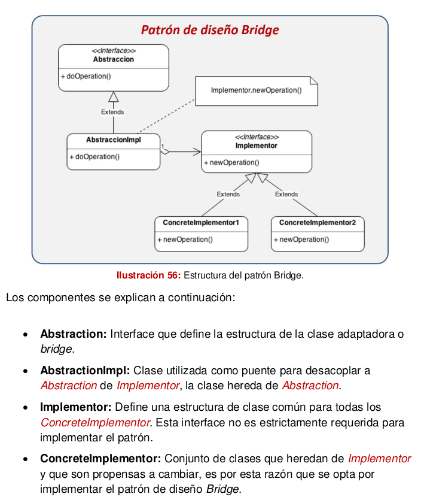

### Decorator

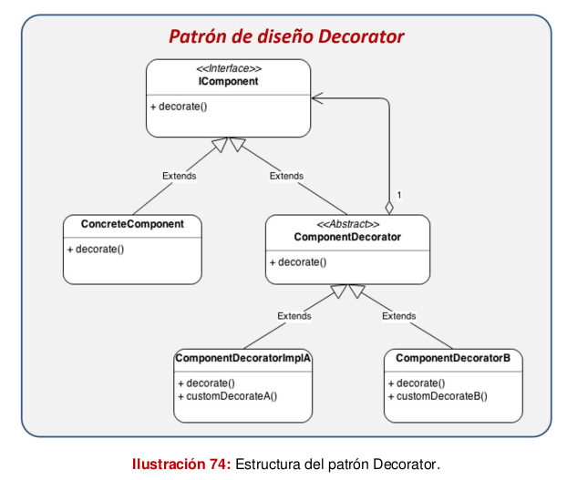

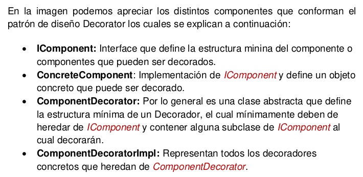

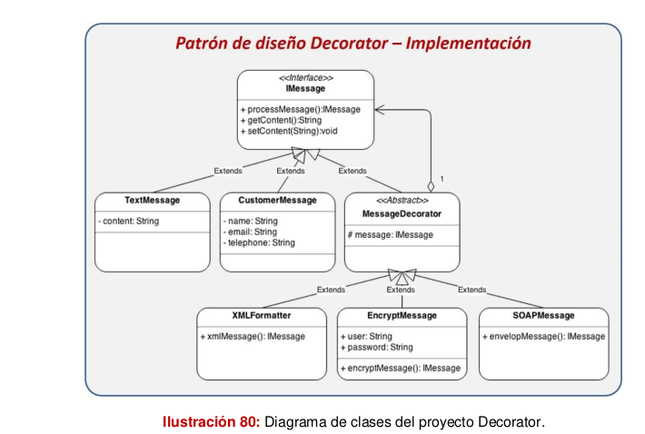

### Flyweight

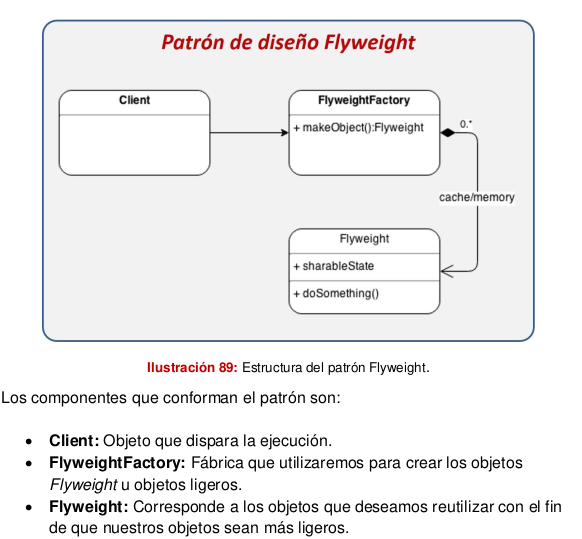

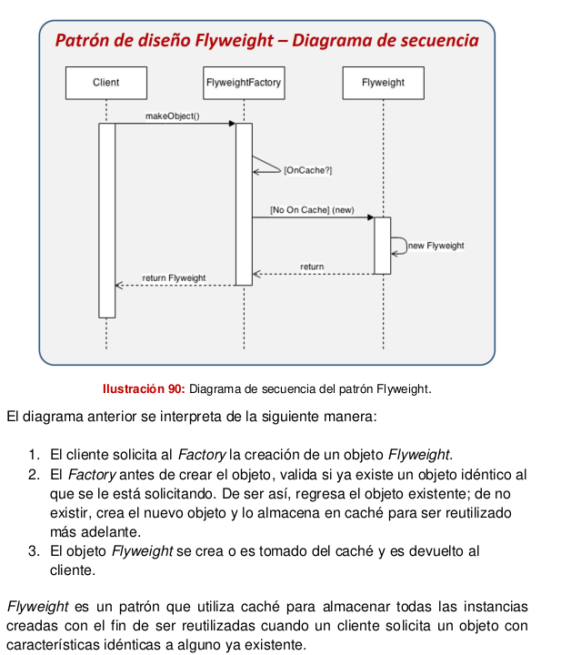

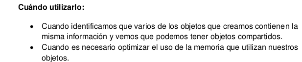

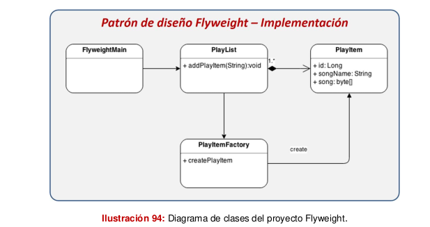

## Behavioral

### Command

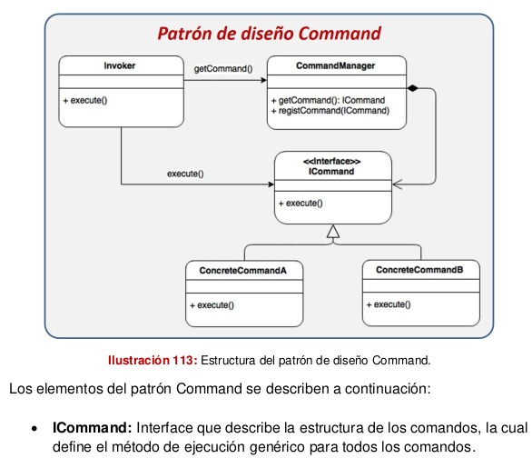
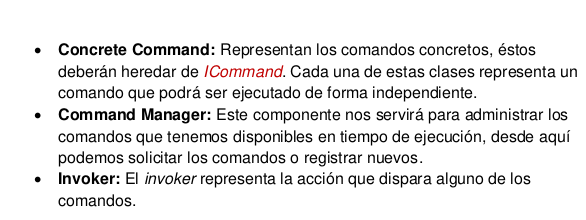
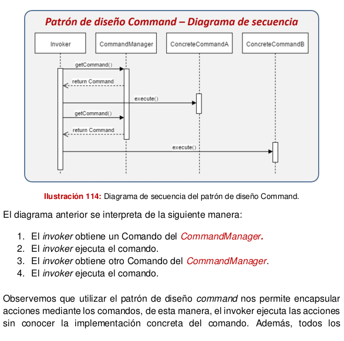
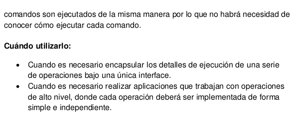

### Observer

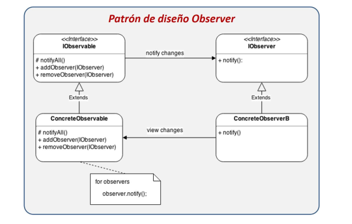
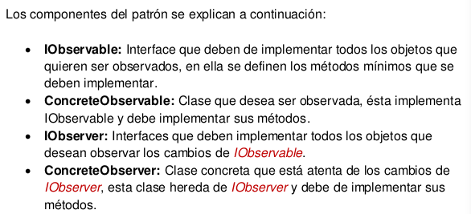
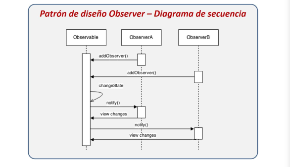
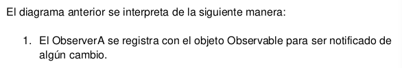
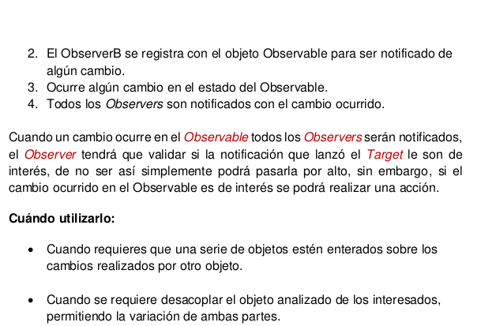

### Strategy

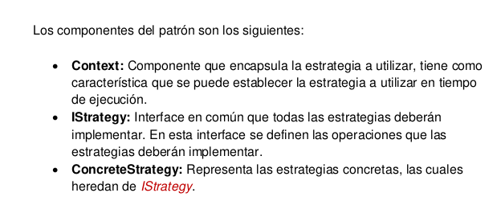
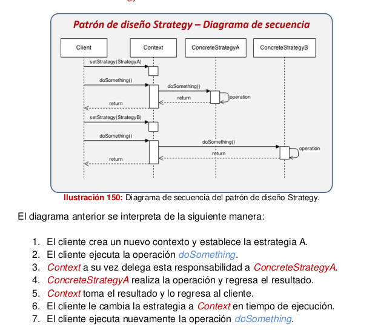
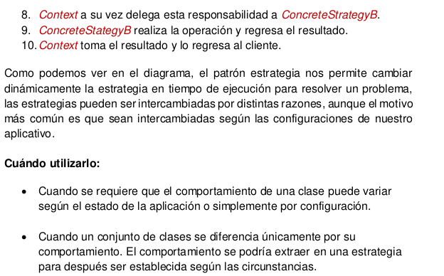

### Iterator

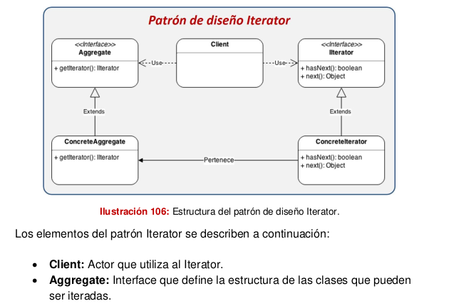

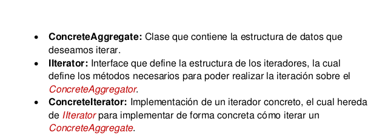

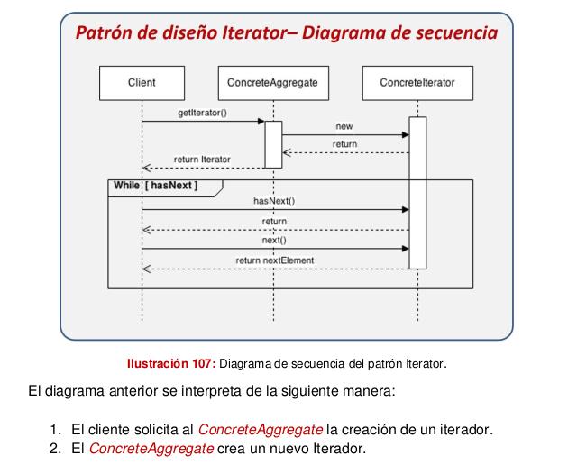

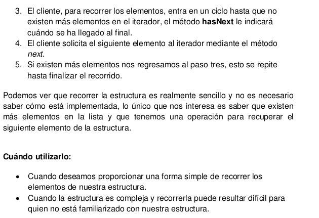

### Template Method

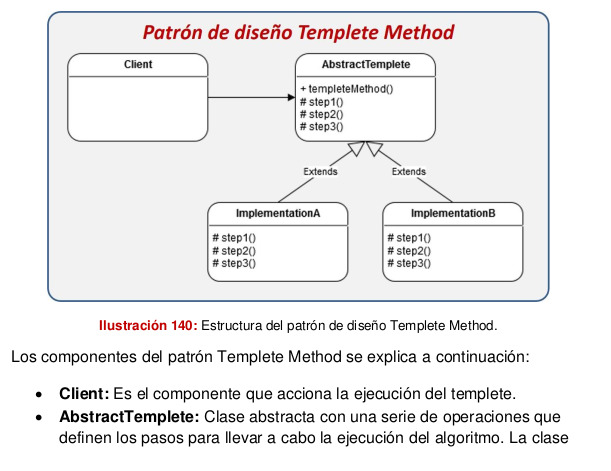
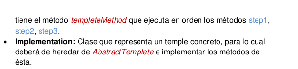
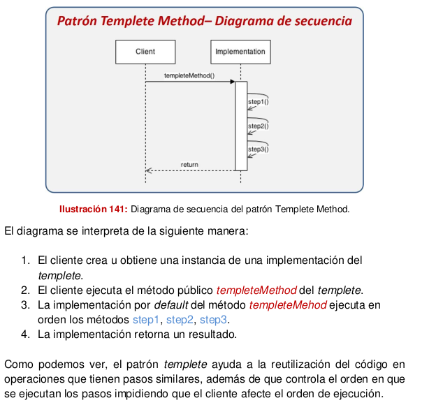
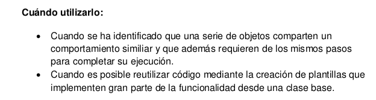
