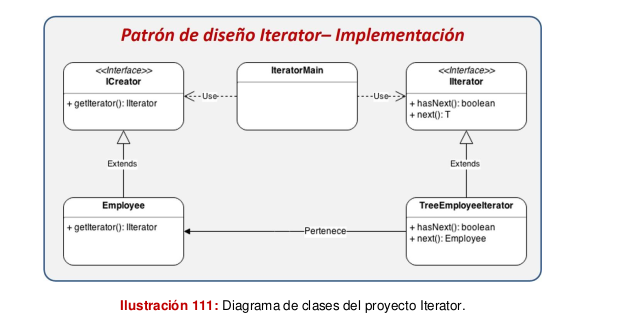

# Codmind Design Patterns Course

## Creational

### Factory method

### Abstract factory

### Singleton

### Builder

### Prototype

### Object Pool

## Structural

### Adapter

### Composite

### Proxy

### Facade

### Bridge

### Decorator

### Flyweight

## Behavioral

### Command

### Observer

### Strategy

### Iterator

